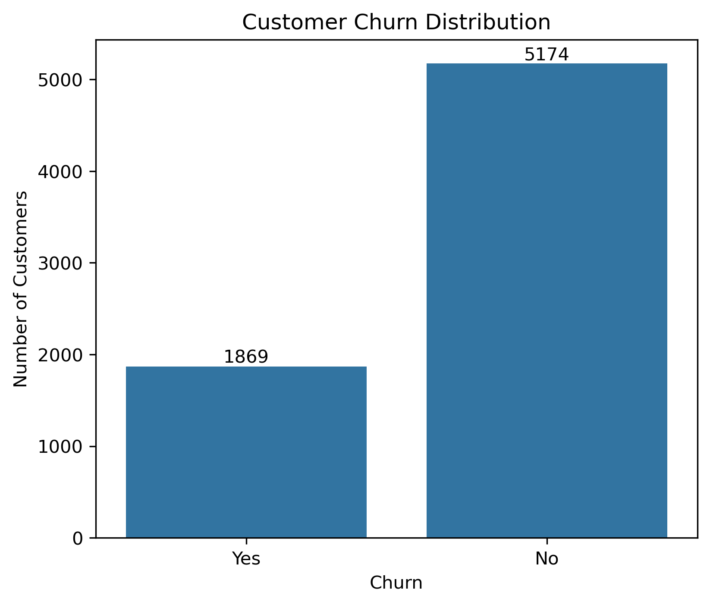
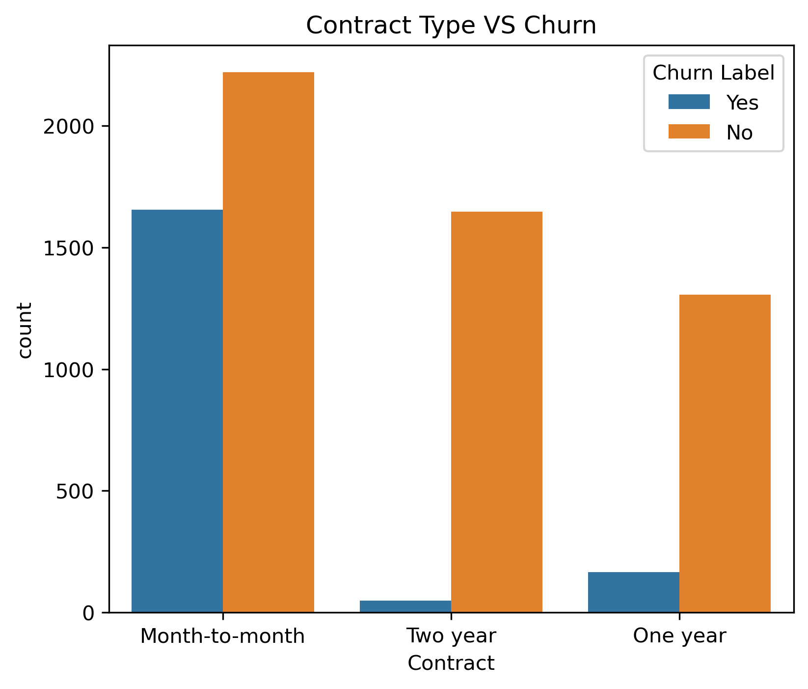
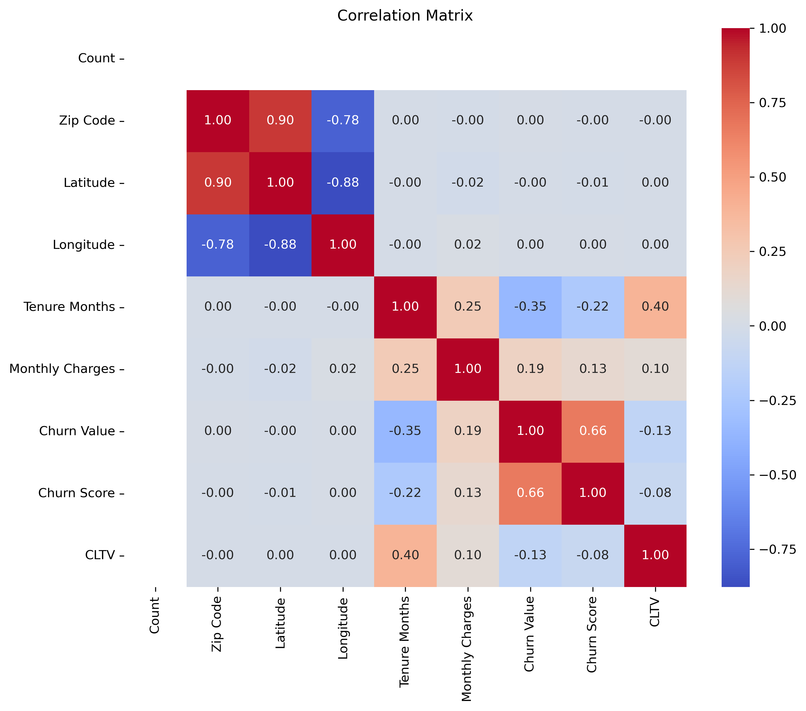
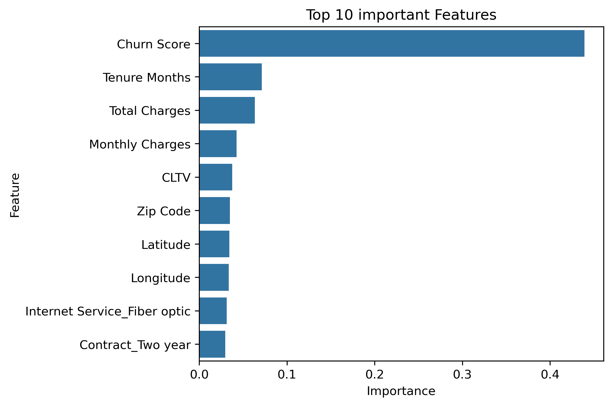

# 📊 Customer Churn Prediction using Machine Learning

An end-to-end Machine Learning project that predicts customer churn using the IBM Telco Customer Churn dataset. The project follows a complete Data Science workflow, including data preprocessing, exploratory data analysis (EDA), feature engineering, model building, evaluation, and business insights.

---

## 🚀 Project Overview

Customer churn is one of the biggest challenges for subscription-based businesses. Identifying customers who are likely to leave enables organizations to take proactive retention measures.

In this project, multiple Machine Learning algorithms were implemented and compared to predict customer churn based on customer demographics, subscription details, and service usage patterns.

---

## 🎯 Objectives

- Perform data cleaning and preprocessing
- Conduct Exploratory Data Analysis (EDA)
- Identify key factors contributing to customer churn
- Build and compare multiple Machine Learning models
- Evaluate model performance using classification metrics
- Generate business insights for customer retention

---

## 🛠️ Tech Stack

- Python
- Pandas
- NumPy
- Matplotlib
- Seaborn
- Scikit-learn
- Joblib
- Jupyter Notebook

---

## 📂 Project Structure

```
Customer-Churn-Prediction
│
├── customer_churn.ipynb
├── customer_churn_model.pkl
├── scaler.pkl
├── requirements.txt
│
├── churn_distribution.png
├── contract_vs_churn.png
├── correlation_heatmap.png
├── feature_importance.png
│
└── README.md
```

---

## 📈 Machine Learning Workflow

1. Data Collection
2. Data Cleaning
3. Exploratory Data Analysis (EDA)
4. Feature Engineering
5. Data Preprocessing
6. Train-Test Split
7. Model Building
8. Model Evaluation
9. Feature Importance Analysis
10. Business Insights

---

## 🤖 Models Implemented

- Logistic Regression
- Decision Tree Classifier
- Random Forest Classifier

---

## 📊 Evaluation Metrics

The models were evaluated using:

- Accuracy Score
- Precision
- Recall
- F1 Score
- Confusion Matrix

---

## 📌 Exploratory Data Analysis

The following visualizations were created to understand customer behavior and identify churn patterns:

- Customer Churn Distribution
- Contract Type vs Churn
- Correlation Heatmap
- Feature Importance

---

## 📷 Project Visualizations

### Customer Churn Distribution



---

### Contract Type vs Churn



---

### Correlation Heatmap



---

### Feature Importance



---

## 💡 Key Business Insights

- Customers with month-to-month contracts have a significantly higher churn rate.
- Customers with shorter tenure are more likely to leave the service.
- Higher monthly charges are associated with increased customer churn.
- Long-term contract customers show better retention.
- Contract type, tenure, and monthly charges are among the most influential features for predicting churn.

---

## 📁 Dataset

**Dataset:** IBM Telco Customer Churn Dataset

The dataset contains customer demographic information, service subscriptions, billing details, and churn status.

Target Variable:

- **Churn**
  - Yes → Customer Left
  - No → Customer Stayed

---

## ▶️ How to Run the Project

### Clone the Repository

```bash
git clone https://github.com/your-username/customer-churn-prediction.git
```

### Navigate to the Project Folder

```bash
cd customer-churn-prediction
```

### Install Required Libraries

```bash
pip install -r requirements.txt
```

### Launch Jupyter Notebook

```bash
jupyter notebook
```

Open:

```
customer_churn.ipynb
```

---

## 🔮 Future Improvements

- Hyperparameter Tuning using GridSearchCV
- Cross Validation
- XGBoost Classifier
- Model Deployment using Flask/FastAPI
- Interactive Dashboard using Streamlit
- Real-time Churn Prediction API

---

## 👨‍💻 Author

**Tapas Kumar Nayak**

Data Science Enthusiast | SQL | Python | Machine Learning | Power BI

- LinkedIn: *([LinkedIn](https://www.linkedin.com/in/techytapas/))*
- GitHub: *([GitHub](https://github.com/techytapas23))*

---

## ⭐ If you found this project helpful, consider giving it a Star!
